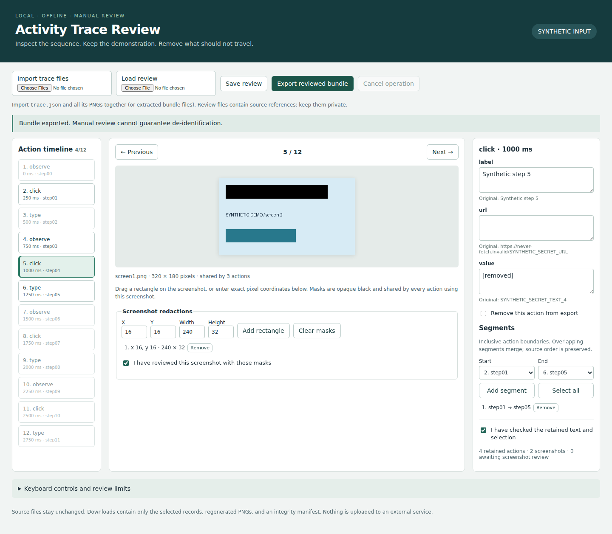

# Activity Trace Review

An offline workbench for manually reviewing computer-action traces and exporting selected, explicitly redacted examples. Recorded actions and URLs are **inert data**: this application never executes them, follows links, or records activity.

The complete demonstration uses generated images and planted synthetic secrets. No personal activity or private dataset is needed.



## Install and try it

Requires Python 3.11+ on a POSIX system with interval timers (tested on Linux/Python 3.12). Package installation needs an available Pillow wheel; the application itself runs offline. Chromium is only needed for automated browser verification.

```sh
python3 -m venv .venv
.venv/bin/python -m pip install -e .
.venv/bin/activity-trace demo .demo
.venv/bin/activity-trace serve .demo/source
```

If `venv` reports that `ensurepip` is missing, install your operating system's Python venv support before creating the environment. Open the complete `http://127.0.0.1:8765/#…` URL printed by the server. Its random token is required; keep it private. The server binds only to loopback. Ctrl+C stops it.

1. Inspect actions with the timeline, Previous/Next, or arrow keys. Each action displays its timestamp, text, and synchronized screenshot.
2. Choose inclusive start/end actions and add segments. Remove the initial full-trace segment when selecting a subset. Overlapping segments merge in source order.
3. Remove unwanted actions. Replace individual text fields, including URLs. An empty replacement keeps the field with an empty string.
4. Drag opaque black rectangles over screenshots, or enter exact integer pixel coordinates. A mask applies to every retained action sharing that screenshot. Changing a mask clears that screenshot's review state.
5. Explicitly review every retained screenshot and confirm the retained text and selection. Export remains disabled until those checks are complete.
6. Save the source-bound review JSON to resume later. Export downloads a deterministic ZIP containing `trace.json`, `manifest.json`, and regenerated PNGs. Extract the ZIP into a new directory to reopen or validate it. The app never extracts arbitrary ZIP inputs.

`serve` without a source opens an empty workbench. Use **Import trace files** to select `trace.json` and all referenced PNGs together. Extracted exported bundles can include their manifest. Invalid imports and review loads leave the current work unchanged. A valid source import replaces the current review; save it first. Reviews are not autosaved to disk. Refreshing requires reopening the complete server URL and can discard unsaved browser edits.

Keyboard controls (outside editable controls): ← / →, Home / End, `[` / `]` to set segment boundaries, `A` to add a segment, `D` to toggle removal, and `R` to toggle screenshot review. Ctrl/Cmd+S saves a review, including while editing a field.

## CLI example

The `demo` command also creates `example-review.json`. That specification marks the **known planted synthetic fixture** as reviewed; it is an executable example, not an automatic privacy reviewer. Newly created reviews and all browser imports start unconfirmed.

```sh
.venv/bin/activity-trace inspect .demo/source
.venv/bin/activity-trace review .demo/source .demo/my-review.json
.venv/bin/activity-trace export .demo/source .demo/example-review.json .demo/export
.venv/bin/activity-trace validate .demo/export
.venv/bin/activity-trace serve .demo/export
```

All output destinations must be fresh. A collision, including an existing empty directory, is rejected. Source files are read without alteration. `inspect` reports SHA-256 hashes of the exact input trace and referenced image bytes. Keep source files and review specifications private. Only share an export after checking it.

## Verification

Install verification tools and cache the browser and runtime wheel once (these preparation steps use the network):

```sh
.venv/bin/python -m pip install -r requirements-dev.txt
PLAYWRIGHT_BROWSERS_PATH=/tmp/activity-trace-browsers .venv/bin/python -m playwright install chromium
.venv/bin/python -m pip download --only-binary=:all: --no-deps --dest /tmp/activity-trace-wheelhouse Pillow==11.3.0
```

Then run the complete verification offline with one command:

```sh
.venv/bin/python scripts/verify.py
```

The command requires GNU `/usr/bin/time` for measured peak RSS. It runs the core tests, **240 seeded independent export cases**, a real Chromium workflow with non-workbench browser requests blocked, an isolated wheel-installed CLI example with Python network connection/DNS APIs denied, and two bounded performance workloads. It checks deterministic replay and source hashes. It updates [measured results](results/verification.json), [browser evidence](results/browser.json), [benchmarks](results/benchmark.json), and [plain test output](results/tests.log). `TRACE_WHEELHOUSE` and `PLAYWRIGHT_BROWSERS_PATH` override the caches. Offline verification cannot bootstrap absent dependencies.

See [format and review semantics](docs/format.md), [validation scope and limitations](docs/validation.md), and [related work](docs/related-work.md).

## Limits that matter

Manual review **cannot guarantee de-identification**. Retained text, timestamps, action kinds, and unmasked pixels may identify someone or disclose sensitive information. Export intentionally preserves retained timestamps; it does not anonymize timing. Original identifiers, source filenames, input hashes, image metadata, unreferenced screenshots, removed actions, review files, and replaced text are excluded from the generated artifact structure. This is not a promise that another retained field or unmasked image cannot contain the same information.

Input is bounded to 128 actions, 64 PNGs, 24 MiB, 2,048 pixels per image side, and 16,777,216 total decoded pixels. JSON is limited to 512 KiB. Each CLI operation or API request has a 10-second POSIX timer; core loops also check cancellation and time. Detailed bounds are in the format document. Extremely slow machines or incompressible images can hit a limit before reaching the maximum action count.

The server is a single-user local tool, not a hardened shared service. Anyone controlling the local machine or possessing the token can access the loaded trace. Review files and downloads are ordinary files with no encryption. Browser export cancellation prevents the download; already submitted bounded server work may finish. Imports cannot be cancelled once submitted for their atomic validation/commit. Ctrl+C cancels CLI work and cleans a partially written destination during ordinary exception handling; forced termination or power loss may leave a partial directory.

Synthetic fixtures do not establish compatibility with any activity recorder. Human usability, screen-reader usability, other browsers, macOS, Windows, adversarial native image decoders, and downstream model training have not been validated. No novelty claim, automatic secret detection, medical claim, or training-quality claim is made.
